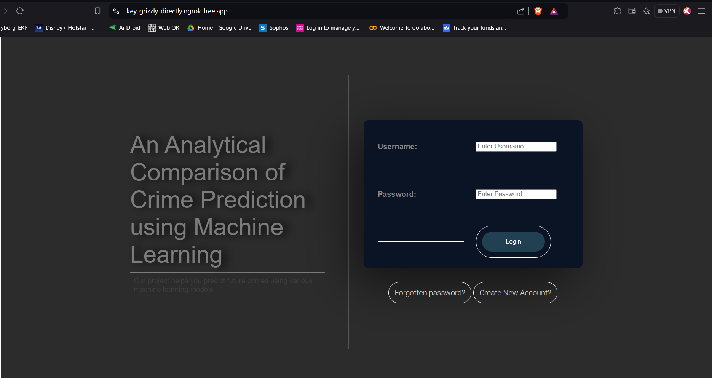
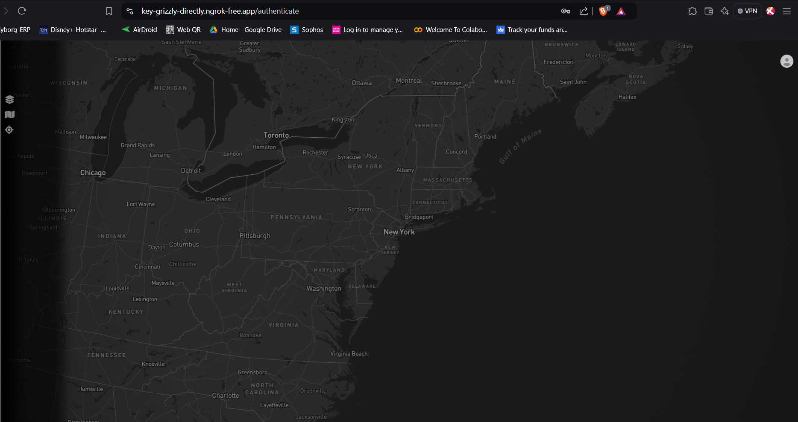

## Overview
The Crime Prediction App is an innovative solution that helps Law enforcement agencies in tackling most affected crime areas with the help of various machine learning algorithms, allowing for timely intervention and proper resource allocation. By leveraging machine learning techniques, this app analyzes historical trends of crimes of cities like New York, Chicago and predicts future crimes.

Features
<ol type='1'>
<li>Login page: User can Create, Login in his Account, user data will be saved in the database.</li>
<li>API Integration:  With the Integration of Mapbox APIs, allows visualization of crimes Hotspot and clusters on Maps.</li>
<li>Crime Analysis: The app provides crime analysis using graphs and displayed on map alongside.</li>
<li>Crime Prediction: The prediction results of the selected city are displayed, making it easy for users to see future crimes on map.</li>
</ol>

## How It Works
- Frontend:
The frontend is built using modern web technologies such as HTML5, CSS, Javascript and Python Flask. It provides a user-friendly interface for interacting with the app. I have also integrated Mapbox APIs, to provide better crime analysis using graphs, Hotspots and Clusters.

Here’s a sneak peek of the frontend: 

 
Fig. 1. User Login Page

 
Fig. 2. Main Page

- Image Processing:
When a user captures or uploads an image, the frontend sends it to the backend for analysis.
The backend processes the image using a pre-trained deep learning model (such as a convolutional neural network) specifically trained for plant disease classification.

- Backend:
The backend is responsible for handling image processing, model inference, and returning the prediction results.
Here's the System Architecture Diagram of this Application:

- Prediction Results:
Once the backend processes the image, it returns the predicted disease class with species (e.g., Apple Cedar Rust, Potato Early Blight, Peach Bacterial Spot, etc) to the frontend.
The frontend displays this information to the user.