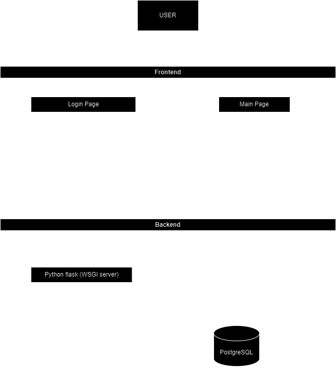
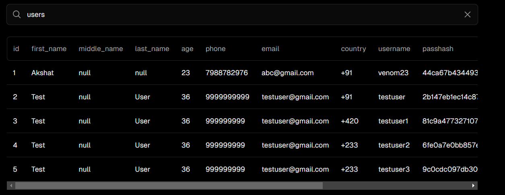

## Overview
The Crime Prediction App is an innovative solution that helps Law enforcement agencies in tackling most affected crime areas with the help of various machine learning algorithms, allowing for timely intervention and proper resource allocation. By leveraging machine learning techniques, this app analyzes historical trends of crimes of cities like New York, Chicago and predicts future crimes.

## Features

- <b>Login page:</b> User can create, login account, user data will be saved in the database.
- <b>Switch Map Layers:</b> User can change map layers (eg, Streets, Satellite, etc.)
- <b>Crime Analysis:</b> The app provides a new way to analyze crimes using graphs and displayed on map alongside.
- <b>Crime Prediction:</b> The prediction results of the selected city are displayed, making it easy for users to analyse future crimes graphically.

Here's the System Architecture Diagram of this Application:

## How It Works
- Frontend:
The frontend is built using modern web technologies such as HTML5, CSS, Javascript. It provides a user-friendly interface for interacting with the app. With the Integration of [Mapbox APIs](https://docs.mapbox.com/), allows visualization of crime Hotspots and clusters on 3D maps. Also, used libraries like Chart.js, which allows better visualization of crimes using charts and graphs.

Here’s a sneak peek of the frontend: 

This is the user's login page. Here, you can login and create your new account and even change the password of your account.

 
Fig. 1. User Login Page

After logging in, you’ll be automatically redirected to the main page. If you click the user icon in the top right corner, your account information will slide out. From there, you can edit your account details if needed

&nbsp&nbsp
 
Fig. 2. View of the Main Page

This is the Crime Analysis Section 

&nbsp&nbsp
 
&nbsp&nbsp
 
Fig. 3. User Login Page

- Backend:
The backend is built using Python Flask web framework which is responsible for handling the incoming requests from clients (such as create user, check user, authenticate, change password etc.) and keep maintaining user database, model inference, and returning the analysis and prediction results. 

- Database:
The MySQL database in our application serves as the central repository for user-related data. It stores information about users, authentication credentials, and other profile details. Database is connected through SSH tunneling protocol. The SSH tunnel ensures that communication between servers is securely encrypted. It establishes a protected channel over an insecure network, preventing eavesdropping or interception of sensitive data"

This database is maintained in my Local Machine

- Prediction Results:
Once the backend processes the data, it returns the prediction results to the frontend.
The frontend displays this information to the user.

